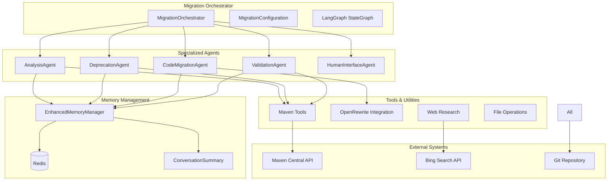

# Java 11 to 21+ Migration Agent System - Comprehensive Technical Documentation

## Table of Contents
1. [System Overview](#system-overview)
2. [Architecture & Core Components](#architecture--core-components)
3. [Data Models & State Management](#data-models--state-management)
4. [Agent Architecture](#agent-architecture)
5. [Memory Management System](#memory-management-system)
6. [Migration Tools & Utilities](#migration-tools--utilities)
7. [Orchestration & Workflow](#orchestration--workflow)
8. [Configuration System](#configuration-system)
9. [Error Handling & Recovery](#error-handling--recovery)
10. [Human-in-the-Loop Integration](#human-in-the-loop-integration)
11. [Usage Examples & Demonstrations](#usage-examples--demonstrations)
12. [Technical Implementation Details](#technical-implementation-details)

---

## System Overview

The Java Migration Agent System is a sophisticated, AI-powered automation framework designed to migrate Maven-based Java projects from Java 11 to Java 21+. The system combines multiple specialized agents, advanced memory management, LLM-powered analysis, and human-in-the-loop decision making to handle complex migration scenarios.

### Key Capabilities
- **Configurable Migration Phases**: Enable/disable any migration phase based on project needs
- **Advanced Deprecation Detection**: LLM-powered analysis of deprecated APIs, plugins, and patterns
- **Automated Code Transformation**: OpenRewrite integration for systematic code changes
- **Large Context Memory**: 200,000 token context windows with proactive summarization
- **Concurrent Operations**: File-level locking for safe parallel operations
- **Error Recovery**: Automated build/test error analysis and fixing with retry cycles
- **Web Research Integration**: Bing Search API for finding migration solutions
- **Human Escalation**: Intelligent escalation for complex decisions

### Target Migration Scenarios
- Java 11 → 17 → 21 (incremental approach)
- Spring Boot 2.x → 3.x upgrades
- javax.* → jakarta.* namespace migration
- JUnit 4 → JUnit 5 migration
- Maven plugin modernization
- Deprecated API replacement

---

## Architecture & Core Components

### High-Level Architecture



### Component Responsibilities

| Component | Primary Responsibility | Key Features |
|-----------|------------------------|--------------|
| **MigrationOrchestrator** | Coordinates entire migration workflow | LangGraph-based state management, configurable phases |
| **AnalysisAgent** | Project analysis and dependency checking | Maven Central API integration, risk assessment |
| **DeprecationAgent** | Deprecated API/plugin detection | LLM-powered analysis, automatic replacements |
| **CodeMigrationAgent** | Code transformation execution | OpenRewrite recipes, Java version upgrades |
| **ValidationAgent** | Testing and build validation | AI-powered error analysis, automated fixing |
| **HumanInterfaceAgent** | Human escalation and decision collection | Risk-based escalation, decision persistence |
| **EnhancedMemoryManager** | Large context memory management | 200k tokens, proactive summarization |

---

## Data Models & State Management

### Core Data Models

```python
# LangGraph State Definition - Central state for workflow orchestration
class AgentState(TypedDict):
    messages: Annotated[List[Dict[str, str]], add_messages]  # Conversation history
    project_path: str                                        # Target project path
    session_id: str                                         # Unique session identifier
    current_phase: str                                      # Current migration phase
    error_count: int                                        # Consecutive error counter
    last_action_result: str                                 # Result of last action
    escalation_needed: bool                                 # Human intervention flag

# Migration State - Persistent state across sessions
class MigrationState(BaseModel):
    project_path: str                    # Project being migrated
    current_phase: MigrationPhase        # Current phase enum
    completed_steps: List[str]           # Successfully completed steps
    failed_attempts: Dict[str, List[str]] # Failed attempts by phase
    checkpoints: List[str]               # Git commit hashes
    human_decisions: List[Decision]      # Human decision history
    risk_assessment: Dict[str, str]      # Risk analysis results
    session_id: str                      # Session identifier
    started_at: str                      # Migration start time
    last_updated: str                    # Last update timestamp
```

### Migration Phases

```python
class MigrationPhaseType(Enum):
    ANALYSIS = "analysis"                           # Project structure analysis
    DEPRECATION_DETECTION = "deprecation_detection" # Find deprecated components
    DEPENDENCY_UPDATE = "dependency_update"         # Update Maven dependencies
    CODE_MIGRATION = "code_migration"              # Apply code transformations
    TESTING_VALIDATION = "testing_validation"      # Run tests and validate
    PERFORMANCE_VALIDATION = "performance_validation" # Performance benchmarks
    FINAL_CLEANUP = "final_cleanup"                # Cleanup and optimization
```

### State Flow Through System

1. **Initialization**: AgentState created with project path and session ID
2. **Phase Execution**: Each enabled phase modifies state with results
3. **Error Handling**: Error count increments on failures, triggers escalation
4. **Decision Points**: State determines next phase or escalation needs
5. **Persistence**: MigrationState saved to Redis after each phase
6. **Recovery**: State can be restored to resume interrupted migrations

---

## Agent Architecture

### Agent Design Pattern

All agents follow a consistent design pattern optimized for LangGraph integration:

```python
class BaseAgentPattern:
    def __init__(self, session_id: str):
        self.session_id = session_id
        self.agent_name = "agent_type"
        
        # Enhanced memory with large context
        self.memory_manager = EnhancedMemoryManager(
            session_id=session_id,
            agent_name=self.agent_name,
            max_tokens=200000,
            summarize_threshold=0.7
        )
        
        # LangChain tools specific to this agent
        self.tools = [tool1, tool2, tool3]
        
        # LangGraph react agent
        self.agent = create_react_agent(CLAUDE_SONNET, self.tools)
    
    def execute_phase(self, state: AgentState) -> AgentState:
        # Get conversation context from enhanced memory
        conversation_buffer = self.memory_manager.get_conversation_buffer()
        
        # Create comprehensive prompt with context
        prompt = self._create_context_aware_prompt(state, conversation_buffer)
        
        # Execute with LangGraph agent
        result = self.agent.invoke({"messages": [{"role": "user", "content": prompt}]})
        
        # Store results in enhanced memory
        self.memory_manager.add_message(prompt, "human")
        self.memory_manager.add_message(result_content, "assistant")
        
        # Update state and return
        return self._update_state(state, result)
```

### Detailed Agent Breakdown

#### 1. AnalysisAgent
**Purpose**: Comprehensive project analysis and dependency evaluation

**Key Tools**:
- `check_maven_dependency_updates`: Query Maven Central API for latest versions
- `research_migration_patterns`: Web research for specific migration topics

**Process Flow**:
1. Scan `pom.xml` for current Java version and dependencies
2. Query Maven Central API for available updates
3. Assess migration complexity and risks
4. Research specific technologies found in project
5. Generate comprehensive analysis report with recommendations

**Memory Usage**: Stores detailed dependency information, risk assessments, and research findings for context in later phases.

#### 2. DeprecationAgent
**Purpose**: Advanced detection and replacement of deprecated components

**Key Tools**:
- `run_maven_with_deprecation_analysis`: Execute Maven with deprecation warnings
- `analyze_deprecated_apis_with_llm`: LLM-powered deprecation analysis
- `scan_maven_plugins_deprecation`: Check for outdated Maven plugins
- `auto_replace_simple_deprecations`: Automated safe replacements
- `generate_deprecation_report`: Comprehensive deprecation documentation

**Process Flow**:
1. **Maven Build Analysis**: Run Maven with `-Xlint:deprecation` to capture warnings
2. **Pattern Extraction**: Parse deprecation warnings using regex patterns
3. **LLM Analysis**: Send warnings to Claude Sonnet for intelligent analysis
4. **Plugin Scanning**: Check Maven plugins against known deprecation database
5. **Automatic Replacement**: Apply safe replacements (e.g., `new Integer()` → `Integer.valueOf()`)
6. **Categorization**: Classify deprecations by complexity and risk
7. **Report Generation**: Create detailed report with manual review items

**Unique Features**:
- **Configurable Depth**: Deep scan vs. quick scan options
- **Transitive Analysis**: Include transitive dependency deprecations
- **Safety Checks**: Only apply transformations with high confidence
- **Learning System**: Remember successful patterns for future use

#### 3. CodeMigrationAgent
**Purpose**: Execute systematic code transformations and version upgrades

**Key Tools**:
- `run_maven_tests`: Execute test suites with detailed failure analysis
- `run_maven_build`: Full build execution with error categorization
- `run_test_fix_cycle`: Automated test failure resolution with retry logic
- `run_build_fix_cycle`: Automated build error resolution with retry logic
- `update_maven_dependency`: Targeted dependency version updates
- `auto_fix_common_test_issues`: Common test failure patterns (JUnit 4→5, imports)
- `auto_fix_build_errors`: Common build error patterns (deprecated APIs, missing deps)

**OpenRewrite Integration**:
```python
openrewrite_recipes = {
    "java_11_to_17": "org.openrewrite.java.migrate.Java11to17",
    "java_17_to_21": "org.openrewrite.java.migrate.Java17to21", 
    "spring_boot_3": "org.openrewrite.java.spring.boot3.UpgradeSpringBoot_3_0",
    "javax_to_jakarta": "org.openrewrite.java.migrate.javax.MigrateJavaxToJakarta",
    "junit4_to_5": "org.openrewrite.java.testing.junit5.JUnit4to5Migration"
}
```

**Process Flow**:
1. **Incremental Migration**: Java 11 → 17 → 21 (step-by-step approach)
2. **Recipe Application**: Apply OpenRewrite recipes in dependency order
3. **Build Validation**: Run build after each transformation
4. **Error Resolution**: Automated fixing of common build errors
5. **Test Execution**: Run test suite and fix failures
6. **Retry Logic**: Up to 3 attempts with different strategies per issue

#### 4. ValidationAgent
**Purpose**: Comprehensive testing and validation of migration results

**Key Tools**:
- `run_maven_tests`: Comprehensive test execution
- `run_maven_build`: Full build validation
- `analyze_test_failures_with_ai`: AI-powered test failure analysis
- `analyze_build_errors_with_ai`: AI-powered build error analysis
- `search_build_error_solutions`: Web research for unknown issues

**Validation Criteria**:
- All tests must pass (or maintain previous pass rate)
- Build must complete successfully
- No deprecated API warnings remaining
- Performance benchmarks maintained
- Security vulnerabilities addressed

#### 5. HumanInterfaceAgent
**Purpose**: Intelligent escalation and human decision collection

**Escalation Triggers**:
- **Error Loops**: Same error 3+ times
- **No Progress**: 5+ actions without progress
- **High Risk**: Changes affecting core functionality
- **Unknown Patterns**: Code patterns not covered by existing recipes

**Decision Interface**:
```json
{
  "escalation_type": "ambiguous_migration",
  "context": {
    "file": "src/main/java/com/example/Service.java",
    "issue": "Custom annotation with complex logic",
    "current_code": "...",
    "options": [
      {
        "id": "manual_review",
        "description": "Manual code review and modification",
        "confidence": 0.9,
        "impact": "Requires developer time but safe"
      },
      {
        "id": "skip_file", 
        "description": "Skip this file and document for later",
        "confidence": 0.7,
        "impact": "File remains unmigrated"
      }
    ]
  },
  "recommendation": "manual_review"
}
```

---

## Memory Management System

### EnhancedMemoryManager Architecture

The memory management system is designed to handle extensive migration conversations while maintaining context and performance:

```python
class EnhancedMemoryManager:
    def __init__(self, session_id: str, agent_name: str, 
                 max_tokens: int = 200000,     # 100x larger than previous!
                 summarize_threshold: float = 0.7):  # Summarize at 70% capacity
```

### Key Features

#### 1. Large Context Windows
- **200,000 token capacity** (equivalent to ~800,000 characters)
- **Proactive summarization** at 60-70% capacity (140,000 tokens)
- **Per-agent isolation** - each agent has independent memory
- **Redis persistence** with 24-hour retention

#### 2. Intelligent Summarization
```python
def _proactive_summarize(self):
    # Keep recent messages (last 5) and summarize the rest
    recent_messages = messages[-5:]
    messages_to_summarize = messages[:-5]
    
    summary_prompt = f"""
    Summarize the following conversation history for a Java migration agent session.
    
    Focus on:
    1. Key actions taken and their results
    2. Important findings and decisions  
    3. Errors encountered and how they were resolved
    4. Current state and progress
    5. Any patterns or learnings discovered
    """
    
    summary = self.llm.invoke(summary_prompt).content
    
    # Replace old messages with summary + recent messages
    self.message_history.clear()
    self.message_history.add_ai_message(f"[SUMMARY #{count}]: {summary}")
    
    # Re-add recent messages
    for msg in recent_messages:
        self.message_history.add_message(msg)
```

#### 3. Memory Analytics
- **Token estimation** using character-based approximation
- **Summarization events logging** for analysis
- **Usage statistics** tracked per agent
- **Memory health monitoring** with alerts

### Memory Flow Example

```
Initial Capacity: 200,000 tokens
├── Analysis Phase: 45,000 tokens used (22.5%)
├── Deprecation Detection: 95,000 tokens used (47.5%) 
├── Code Migration: 140,000 tokens used (70%) → SUMMARIZATION TRIGGERED
│   ├── Summary created: 3,000 tokens
│   ├── Recent messages kept: 8,000 tokens  
│   └── New capacity: 11,000 tokens used (5.5%)
├── Validation: 55,000 tokens used (27.5%)
└── Final Cleanup: 72,000 tokens used (36%)
```

---

## Migration Tools & Utilities

### Maven Integration Tools

#### Dependency Management
```python
@tool
def check_maven_dependency_updates(project_path: str) -> str:
    """Query Maven Central API for latest Java 21 compatible versions"""
    # 1. Parse pom.xml to extract dependencies
    # 2. Query Maven Central API for each dependency
    # 3. Compare versions and identify updates
    # 4. Return structured update recommendations
```

#### Build & Test Execution
```python
@tool 
def run_maven_build(project_path: str) -> str:
    """Execute Maven build with comprehensive error analysis"""
    cmd = ["mvn", "clean", "install", "-f", project_path, "-DskipTests=false"]
    # 1. Execute build with timeout protection
    # 2. Capture stdout/stderr
    # 3. Parse errors using regex patterns
    # 4. Categorize errors by type
    # 5. Return structured error analysis
```

### Deprecation Detection Tools

#### Advanced Maven Analysis
```python
@tool
def run_maven_with_deprecation_analysis(project_path: str) -> str:
    """Run Maven with detailed deprecation warning capture"""
    cmd = [
        "mvn", "clean", "compile",
        "-Xlint:deprecation",              # Enable deprecation warnings
        "-Dmaven.compiler.showDeprecation=true",
        "-Dmaven.compiler.showWarnings=true", 
        "-X",                              # Debug mode for more details
        "-f", project_path
    ]
    # 1. Execute Maven with verbose deprecation reporting
    # 2. Parse deprecation warnings using multiple regex patterns
    # 3. Deduplicate and categorize warnings
    # 4. Return structured deprecation analysis
```

#### LLM-Powered Analysis
```python
@tool
def analyze_deprecated_apis_with_llm(project_path: str, deprecation_warnings: str) -> str:
    """Use Claude Sonnet to analyze deprecated APIs and suggest replacements"""
    analysis_prompt = f"""
    Analyze the following Java project for deprecated APIs, methods, and patterns 
    that need modernization for Java 21.
    
    Maven Deprecation Warnings: {deprecation_warnings}
    Sample Source Code: {source_files[:3]}
    
    Provide analysis in JSON format:
    {{
        "deprecated_items": [
            {{
                "item_type": "api|method|annotation|pattern",
                "item_name": "specific name or pattern", 
                "deprecation_reason": "why it's deprecated",
                "suggested_replacement": "modern alternative",
                "migration_steps": ["step 1", "step 2"],
                "confidence_score": 0.0-1.0,
                "complexity": "simple|moderate|complex",
                "breaking_change": true|false,
                "code_example": "example of replacement"
            }}
        ],
        "summary": "overall analysis summary",
        "priority_items": ["most critical items to fix first"]
    }}
    """
```

### Error Recovery Tools

#### Automated Build Fixing
```python
@tool
def run_build_fix_cycle(project_path: str, max_iterations: int = 3) -> str:
    """Automated build error resolution with retry logic"""
    for iteration in range(max_iterations):
        # 1. Run build and capture errors
        build_result = run_maven_build(project_path)
        
        if "✅ Build completed successfully" in build_result:
            break
            
        # 2. Analyze errors with AI
        ai_analysis = analyze_build_errors_with_ai(project_path, build_result)
        
        # 3. Apply automatic fixes
        auto_fixes = auto_fix_build_errors(project_path, build_result)
        
        # 4. If no fixes available, try web research
        if "No automatic fixes" in auto_fixes:
            web_research = search_build_error_solutions(build_result)
            break
```

#### Common Error Patterns
```python
# Automatic fixes for common patterns
java_modernizations = {
    "new Integer(": "Integer.valueOf(",      # Deprecated constructors
    "new Long(": "Long.valueOf(",
    "new Double(": "Double.valueOf(",
    "Thread.stop()": "// Thread.stop() deprecated - use interrupt()",
    ".finalize()": "// finalize() deprecated - use try-with-resources"
}

import_fixes = {
    "javax.servlet": "jakarta.servlet",      # Namespace migration
    "javax.persistence": "jakarta.persistence",
    "javax.validation": "jakarta.validation"
}

assertion_fixes = {
    "Assert.assertEquals": "Assertions.assertEquals",  # JUnit 4→5
    "Assert.assertTrue": "Assertions.assertTrue",
    "Assert.assertNull": "Assertions.assertNull"
}
```

### Web Research Integration

```python
@tool
def search_build_error_solutions(error_message: str) -> str:
    """Search for build error solutions using Bing Search API"""
    # 1. Extract key error terms using regex patterns
    error_terms = _extract_error_terms(error_message)
    query = f"java maven build error {error_terms} solution"
    
    # 2. Execute Bing Search API call
    headers = {'Ocp-Apim-Subscription-Key': BING_SEARCH_API_KEY}
    response = requests.get('https://api.bing.microsoft.com/v7.0/search')
    
    # 3. Process and format results
    # 4. Use Claude Haiku for research analysis (cheaper model for web research)
    # 5. Return actionable recommendations
```

---

## Orchestration & Workflow

### LangGraph State Management

The system uses LangGraph's StateGraph for sophisticated workflow orchestration:

```python
def _create_configurable_workflow(self) -> StateGraph:
    """Create workflow based on configuration"""
    workflow = StateGraph(AgentState)
    enabled_phases = self.config.get_enabled_phases()
    
    # Dynamically add enabled phases
    phase_methods = {
        MigrationPhaseType.ANALYSIS: self._analysis_phase,
        MigrationPhaseType.DEPRECATION_DETECTION: self._deprecation_detection_phase,
        MigrationPhaseType.DEPENDENCY_UPDATE: self._dependency_update_phase,
        MigrationPhaseType.CODE_MIGRATION: self._code_migration_phase,
        MigrationPhaseType.TESTING_VALIDATION: self._testing_validation_phase,
        MigrationPhaseType.PERFORMANCE_VALIDATION: self._performance_validation_phase,
        MigrationPhaseType.FINAL_CLEANUP: self._final_cleanup_phase
    }
    
    # Create conditional edges between phases
    for i, current_phase in enumerate(enabled_phases):
        next_phase = enabled_phases[i + 1] if i + 1 < len(enabled_phases) else None
        
        workflow.add_conditional_edges(
            current_phase.value,
            self._should_continue,  # Decision function
            {
                "continue": next_phase.value if next_phase else "complete",
                "escalate": "escalate",
                "complete": "complete"
            }
        )
```

### Workflow Decision Logic

```python
def _should_continue(self, state: AgentState) -> str:
    """Enhanced decision logic considering phase configuration"""
    current_phase = state.get("current_phase", "unknown")
    
    # Check phase-specific skip conditions
    if current_phase in self.config.phases:
        phase_config = self.config.phases[MigrationPhaseType(current_phase)]
        if state["error_count"] >= phase_config.retry_count:
            if phase_config.skip_on_failure:
                return "continue"  # Skip this phase
            else:
                return "escalate"  # Require human intervention
    
    # Standard continuation logic
    if state["error_count"] >= 3:
        return "escalate"
    elif state["escalation_needed"]:
        return "escalate" 
    elif state["last_action_result"] in ["aborted", "validation_success"]:
        return "complete"
    else:
        return "continue"
```

### Phase Execution Flow

Each phase follows a consistent execution pattern:

```python
def _analysis_phase(self, state: AgentState) -> AgentState:
    """Execute enhanced analysis phase"""
    print("🔍 Analysis Phase")
    state["current_phase"] = "analysis"
    
    # 1. Create Git checkpoint before phase
    self._create_git_checkpoint("Pre-analysis checkpoint")
    
    # 2. Execute agent with enhanced memory
    state = self.analysis_agent.analyze_project(state)
    
    # 3. Log memory usage stats
    memory_stats = self.analysis_agent.memory_manager.get_memory_stats()
    print(f"📊 Memory: {memory_stats['estimated_tokens']:,} tokens ({memory_stats['usage_percentage']:.1f}%)")
    
    return state
```

### Checkpointing System

Git-based checkpointing ensures rollback capability:

```python
def _create_git_checkpoint(self, message: str) -> str:
    """Create Git checkpoint with phase context"""
    try:
        repo = git.Repo(self.project_path)
        repo.git.add(A=True)  # Stage all changes
        commit = repo.index.commit(f"{message} - Session: {self.session_id}")
        print(f"📋 Checkpoint: {commit.hexsha[:8]} - {message}")
        return commit.hexsha
    except Exception as e:
        print(f"⚠️ Checkpoint failed: {e}")
        return ""
```

---

## Configuration System

### Migration Configuration

The system provides extensive configuration options for different migration scenarios:

```python
class MigrationConfiguration:
    """Configurable migration phases and settings"""
    
    def __init__(self):
        self.phases = {
            MigrationPhaseType.ANALYSIS: PhaseConfig(enabled=True, priority=1),
            MigrationPhaseType.DEPRECATION_DETECTION: PhaseConfig(
                enabled=True, 
                priority=2,
                timeout_minutes=45,
                custom_params={
                    "deep_scan": True,
                    "include_transitive_deps": True,
                    "check_plugin_compatibility": True,
                    "analyze_code_patterns": True
                }
            ),
            # ... other phases
        }
        
        self.global_settings = {
            "auto_apply_safe_changes": True,
            "require_confirmation_for_breaking_changes": True,
            "create_backup_before_changes": True,
            "max_parallel_operations": 3,
            "llm_analysis_model": "claude-sonnet",
            "web_research_enabled": True
        }
```

### Phase Configuration

```python
@dataclass
class PhaseConfig:
    """Configuration for individual migration phases"""
    enabled: bool = True                    # Enable/disable phase
    priority: int = 1                       # Execution order
    timeout_minutes: int = 30               # Phase timeout
    retry_count: int = 3                    # Max retry attempts
    skip_on_failure: bool = False           # Skip vs. escalate on failure
    custom_params: Dict[str, any] = None    # Phase-specific parameters
```

### Configuration Examples

#### Quick Migration (Essential Only)
```python
config = MigrationConfiguration()
for phase in MigrationPhaseType:
    config.disable_phase(phase)

# Enable only essential phases
config.enable_phase(MigrationPhaseType.ANALYSIS)
config.enable_phase(MigrationPhaseType.DEPENDENCY_UPDATE)
config.enable_phase(MigrationPhaseType.CODE_MIGRATION)
```

#### Deprecation Analysis Only
```python
config = MigrationConfiguration()
for phase in MigrationPhaseType:
    config.disable_phase(phase)

config.enable_phase(MigrationPhaseType.ANALYSIS)
config.enable_phase(MigrationPhaseType.DEPRECATION_DETECTION, 
                   custom_params={
                       "deep_scan": True,
                       "auto_apply_safe_fixes": True
                   })
```

#### Runtime Reconfiguration
```python
def _reconfigure_phases(self):
    """Allow runtime reconfiguration of phases"""
    print("\n🎛️ Phase Reconfiguration")
    
    for phase, config in self.config.phases.items():
        status = "✅ ENABLED" if config.enabled else "❌ DISABLED"
        print(f"  {phase.value}: {status} (priority: {config.priority})")
    
    # Interactive phase toggling
    while True:
        phase_name = input("\nEnter phase to toggle (or 'done'): ")
        if phase_name.lower() == 'done':
            break
            
        # Find and toggle matching phase
        matching_phase = self._find_phase_by_name(phase_name)
        if matching_phase:
            self.config.phases[matching_phase].enabled = not self.config.phases[matching_phase].enabled
```

---

## Error Handling & Recovery

### Multi-Level Error Recovery

The system implements sophisticated error recovery at multiple levels:

#### 1. Tool-Level Recovery
```python
@tool
def resilient_maven_operation(project_path: str, operation: str) -> str:
    """Maven operations with built-in retry and error handling"""
    max_attempts = 3
    backoff_delay = [1, 3, 5]  # Progressive delays
    
    for attempt in range(max_attempts):
        try:
            result = subprocess.run(cmd, capture_output=True, text=True, timeout=600)
            if result.returncode == 0:
                return f"✅ {operation} completed successfully"
            else:
                # Analyze error and determine if retry is worthwhile
                error_analysis = _analyze_maven_error(result.stderr)
                if not error_analysis.get('retryable', False):
                    break
                    
        except subprocess.TimeoutExpired:
            if attempt < max_attempts - 1:
                print(f"⏰ Timeout on attempt {attempt + 1}, retrying...")
                time.sleep(backoff_delay[attempt])
                continue
            return f"❌ {operation} timed out after {max_attempts} attempts"
    
    return f"❌ {operation} failed after {max_attempts} attempts"
```

#### 2. Phase-Level Recovery
```python
def _execute_phase(self, phase: MigrationPhase) -> bool:
    """Execute phase with retry logic and error recovery"""
    max_retries = self.config.phases[phase].retry_count
    
    for attempt in range(max_retries):
        try:
            success = self._run_phase_implementation(phase)
            if success:
                self.consecutive_errors = 0
                return True
            else:
                self.consecutive_errors += 1
                
                # Check if we should escalate
                if self._should_escalate():
                    escalation_success = self._handle_escalation(phase, f"Phase failed on attempt {attempt + 1}")
                    if escalation_success:
                        return True
                        
        except Exception as e:
            print(f"❌ Phase {phase.value} failed on attempt {attempt + 1}: {e}")
            self.consecutive_errors += 1
    
    # Phase failed after all retries
    return False
```

#### 3. System-Level Recovery
```python
def run_migration(self) -> bool:
    """Execute migration with comprehensive error recovery"""
    try:
        # Initialize with clean state
        initial_state = self._create_initial_state()
        
        # Execute LangGraph workflow
        final_state = self.workflow.invoke(initial_state)
        
        # Analyze final results
        success = self._analyze_final_state(final_state)
        
        if not success:
            # Attempt system-level recovery
            recovery_success = self._attempt_system_recovery(final_state)
            return recovery_success
            
        return True
        
    except Exception as e:
        print(f"\n💥 SYSTEM ERROR: {e}")
        
        # Emergency recovery procedures
        self._emergency_recovery()
        return False
```

### Error Classification System

```python
class ErrorClassification:
    """Categorize errors for appropriate handling"""
    
    RETRYABLE_ERRORS = [
        "connection timeout",
        "network error", 
        "temporary file lock",
        "maven repository unavailable"
    ]
    
    ESCALATION_ERRORS = [
        "compilation error",
        "test failure",
        "dependency conflict",
        "unknown symbol"
    ]
    
    CRITICAL_ERRORS = [
        "out of memory",
        "file system error",
        "corrupted repository",
        "authentication failure"
    ]
    
    @classmethod
    def classify_error(cls, error_message: str) -> str:
        """Classify error for appropriate handling strategy"""
        error_lower = error_message.lower()
        
        if any(pattern in error_lower for pattern in cls.CRITICAL_ERRORS):
            return "critical"
        elif any(pattern in error_lower for pattern in cls.ESCALATION_ERRORS):
            return "escalation"
        elif any(pattern in error_lower for pattern in cls.RETRYABLE_ERRORS):
            return "retryable"
        else:
            return "unknown"
```

---

## Human-in-the-Loop Integration

### Intelligent Escalation System

The system determines when human intervention is needed based on multiple factors:

#### Escalation Triggers
```python
def should_escalate(self, context: Dict[str, Any]) -> bool:
    """Multi-factor escalation decision"""
    
    # 1. Error Loop Detection
    if context.get("consecutive_errors", 0) >= 3:
        return True
    
    # 2. Progress Stagnation  
    if context.get("actions_without_progress", 0) >= 5:
        return True
    
    # 3. Risk Level Assessment
    risk_level = context.get("risk_level", RiskLevel.LOW)
    if risk_level in [RiskLevel.HIGH, RiskLevel.CRITICAL]:
        return True
    
    # 4. Unknown Pattern Detection
    if context.get("unknown_patterns_found", False):
        return True
    
    # 5. Confidence Threshold
    if context.get("confidence_score", 1.0) < 0.6:
        return True
        
    return False
```

#### Risk Assessment Matrix

| Risk Level | Criteria | Human Involvement |
|------------|----------|-------------------|
| **Low** | Standard recipes, all tests pass | Auto-approve |
| **Medium** | Minor test failures, known workarounds | Review summary |
| **High** | Major API changes, multiple test failures | Detailed review |
| **Critical** | Security implications, core logic changes | Full approval required |

#### Escalation Context Creation
```python
def create_escalation(self, escalation_context: EscalationContext) -> Dict[str, Any]:
    """Create comprehensive escalation request"""
    escalation_data = {
        "escalation_type": escalation_context.escalation_type,
        "context": {
            "file_path": escalation_context.file_path,
            "current_code": escalation_context.current_code,
            "issue_description": escalation_context.context.get("issue"),
            "attempted_solutions": escalation_context.context.get("attempts", []),
            "error_history": escalation_context.context.get("errors", []),
            "migration_progress": self._get_migration_progress(),
            "affected_components": self._analyze_impact_scope(escalation_context.file_path)
        },
        "options": escalation_context.options or self._generate_default_options(),
        "recommendation": escalation_context.recommendation,
        "risk_level": escalation_context.risk_level.value,
        "confidence": self._calculate_recommendation_confidence(),
        "timestamp": datetime.now().isoformat(),
        "session_id": self.session_id
    }
    
    # Store in Redis for persistence
    escalation_key = f"escalation:{self.session_id}:{datetime.now().isoformat()}"
    self.redis_client.set(escalation_key, json.dumps(escalation_data))
    
    return escalation_data
```

### Decision Collection Interface

```python
def get_human_decision(self, escalation_id: str) -> Optional[Decision]:
    """Interactive decision collection with rich context"""
    print(f"\n🚨 HUMAN INTERVENTION REQUIRED 🚨")
    print(f"Session: {self.session_id}")
    print(f"Escalation ID: {escalation_id}")
    
    escalation_data = json.loads(self.redis_client.get(escalation_id) or "{}")
    
    # Display comprehensive context
    self._display_escalation_context(escalation_data)
    
    # Present options with confidence scores
    options = escalation_data.get('options', [])
    if options:
        print("\n📋 Available Options:")
        for i, option in enumerate(options):
            confidence_bar = "🟩" * int(option.get('confidence', 0) * 10)
            print(f"{i+1}. {option.get('description', 'No description')}")
            print(f"   Confidence: {confidence_bar} {option.get('confidence', 0):.1%}")
            print(f"   Impact: {option.get('impact', 'Unknown')}")
            
            if option.get('code_example'):
                print(f"   Example: {option['code_example'][:100]}...")
    
    # Collect decision
    choice = input("\nEnter your choice (number) or 'skip': ")
    rationale = input("Rationale for decision: ")
    
    # Additional context questions
    risk_acceptance = input("Accept associated risks? (y/n): ")
    future_similar = input("Apply same decision to similar cases? (y/n): ")
    
    # Create decision record
    decision = Decision(
        timestamp=datetime.now().isoformat(),
        context=escalation_data.get('context', {}),
        file_path=escalation_data.get('file_path', ''),
        issue=escalation_data.get('escalation_type', ''),
        options=options,
        chosen_option=self._parse_choice(choice, options),
        rationale=rationale,
        risk_level=RiskLevel(escalation_data.get('risk_level', 'low')),
        additional_context={
            "risk_acceptance": risk_acceptance.lower().startswith('y'),
            "apply_to_similar": future_similar.lower().startswith('y')
        }
    )
    
    # Persist decision
    decision_key = f"decision:{self.session_id}:{escalation_id}"
    self.redis_client.set(decision_key, decision.json())
    
    return decision
```

### Learning from Decisions

```python
def _learn_from_decision(self, decision: Decision):
    """Learn from human decisions for future automation"""
    learning_data = {
        "pattern": self._extract_decision_pattern(decision),
        "outcome": decision.chosen_option,
        "confidence": self._calculate_decision_confidence(decision),
        "context_features": self._extract_context_features(decision.context)
    }
    
    # Store learning data for future similar situations
    learning_key = f"learning:{decision.issue}:{hash(str(learning_data['context_features']))}"
    self.redis_client.set(learning_key, json.dumps(learning_data), ex=86400*30)  # 30 days
    
    # Update decision patterns database
    self._update_decision_patterns(learning_data)
```

---

## Usage Examples & Demonstrations

### Quick Start Example

```python
# 1. Basic Migration - All Default Phases
def quick_migration_example():
    # Create default configuration
    config = MigrationConfiguration()
    
    # Create orchestrator
    orchestrator = MigrationOrchestrator("/path/to/java-project", config=config)
    
    # Run migration
    success = orchestrator.run_migration()
    
    if success:
        print("🎉 Migration completed successfully!")
    else:
        print("⚠️ Migration completed with issues - check reports")

# Usage
quick_migration_example()
```

### Advanced Configuration Example

```python
# 2. Custom Configuration - Deprecation Focus
def deprecation_focused_migration():
    config = MigrationConfiguration()
    
    # Disable resource-intensive phases
    config.disable_phase(MigrationPhaseType.PERFORMANCE_VALIDATION)
    
    # Configure deprecation detection for deep analysis
    config.update_phase_config(
        MigrationPhaseType.DEPRECATION_DETECTION,
        timeout_minutes=60,
        custom_params={
            "deep_scan": True,
            "include_transitive_deps": True,
            "auto_apply_safe_fixes": True,
            "generate_detailed_report": True
        }
    )
    
    # Enable aggressive error recovery
    config.update_phase_config(
        MigrationPhaseType.CODE_MIGRATION,
        retry_count=5,
        skip_on_failure=False
    )
    
    orchestrator = MigrationOrchestrator("/path/to/project", config=config)
    success = orchestrator.run_migration()
    
    # Access detailed results
    if hasattr(orchestrator, 'deprecation_agent'):
        summary = orchestrator.deprecation_agent.get_deprecation_summary()
        print(f"Found {summary['total_deprecation_items']} deprecated items")
        print(f"Applied {summary['auto_fixes_applied']} automatic fixes")

# Usage  
deprecation_focused_migration()
```

### Memory Monitoring Example

```python
# 3. Memory Usage Monitoring
def monitor_migration_memory():
    # Run migration
    orchestrator = MigrationOrchestrator("/path/to/project")
    session_id = orchestrator.session_id
    
    # Start migration in background thread
    import threading
    migration_thread = threading.Thread(target=orchestrator.run_migration)
    migration_thread.start()
    
    # Monitor memory usage in real-time
    while migration_thread.is_alive():
        memory_report = get_session_memory_report(session_id)
        
        print(f"\n📊 Memory Report - {datetime.now().strftime('%H:%M:%S')}")
        for agent_name, agent_data in memory_report['agents'].items():
            stats = agent_data['memory_stats']
            print(f"  {agent_name}: {stats['estimated_tokens']:,} tokens ({stats['usage_percentage']:.1f}%)")
            
            if stats['summarization_count'] > 0:
                print(f"    🔄 Summarizations: {stats['summarization_count']}")
        
        time.sleep(30)  # Check every 30 seconds
    
    migration_thread.join()

# Usage
monitor_migration_memory()
```

### Error Recovery Testing

```python
# 4. Error Recovery Demonstration
def test_error_recovery():
    # Create project with intentional issues
    test_project = create_problematic_test_project()
    
    config = MigrationConfiguration()
    # Enable aggressive retry settings
    config.update_phase_config(
        MigrationPhaseType.CODE_MIGRATION,
        retry_count=5,
        timeout_minutes=45
    )
    
    orchestrator = MigrationOrchestrator(test_project, config=config)
    
    # Run with error injection
    success = orchestrator.run_migration()
    
    # Analyze error recovery performance
    error_log = get_session_error_log(orchestrator.session_id)
    print(f"Total errors encountered: {len(error_log)}")
    print(f"Errors resolved automatically: {sum(1 for e in error_log if e['resolved'])}")
    print(f"Errors requiring escalation: {sum(1 for e in error_log if e['escalated'])}")

# Usage
test_error_recovery()
```

### Interactive Configuration

```python
# 5. Interactive Phase Configuration
def interactive_migration_setup():
    print("🎛️ Interactive Migration Configuration")
    print("="*50)
    
    # Show available phases
    print("Available Migration Phases:")
    for i, phase in enumerate(MigrationPhaseType, 1):
        print(f"  {i}. {phase.value}")
    
    # Collect user preferences
    config = MigrationConfiguration()
    
    # Interactive phase selection
    selected_phases = input("Enter phase numbers to enable (comma-separated, or 'all'): ")
    
    if selected_phases.lower() == 'all':
        enabled_phases = list(MigrationPhaseType)
    else:
        phase_indices = [int(x.strip()) - 1 for x in selected_phases.split(',')]
        enabled_phases = [list(MigrationPhaseType)[i] for i in phase_indices]
    
    # Configure selected phases
    for phase in MigrationPhaseType:
        if phase in enabled_phases:
            config.enable_phase(phase)
        else:
            config.disable_phase(phase)
    
    # Deprecation detection configuration
    if MigrationPhaseType.DEPRECATION_DETECTION in enabled_phases:
        print("\n🔍 Deprecation Detection Configuration:")
        deep_scan = input("Enable deep scan? (y/n): ").lower().startswith('y')
        auto_fix = input("Apply automatic fixes? (y/n): ").lower().startswith('y')
        
        config.update_phase_config(
            MigrationPhaseType.DEPRECATION_DETECTION,
            custom_params={
                "deep_scan": deep_scan,
                "auto_apply_safe_fixes": auto_fix
            }
        )
    
    # Get project path
    project_path = input("\nEnter project path: ")
    
    # Run migration
    orchestrator = MigrationOrchestrator(project_path, config=config)
    success = orchestrator.run_migration()
    
    return success

# Usage
interactive_migration_setup()
```

---

## Technical Implementation Details

### Dependencies & Requirements

```python
# Core dependencies
requirements = {
    "langchain": ">=0.1.0",           # LangChain framework
    "langchain-openai": ">=0.0.5",   # OpenAI integration
    "langgraph": ">=0.0.40",         # LangGraph for workflows
    "langchain-community": ">=0.0.20", # Community tools
    "openai": ">=1.0.0",             # OpenAI API client
    "redis": ">=5.0.0",              # Redis for memory/state
    "gitpython": ">=3.1.0",          # Git integration  
    "pydantic": ">=2.0.0",           # Data validation
    "requests": ">=2.31.0",          # HTTP requests
    "filelock": ">=3.12.0"           # File locking
}

# System requirements
system_requirements = {
    "python": ">=3.9",               # Python version
    "java": ">=11",                  # Java for OpenRewrite
    "maven": ">=3.6",                # Maven build tool
    "git": ">=2.0",                  # Git version control
    "redis": ">=6.0"                 # Redis server
}
```

### Performance Characteristics

| Component | Memory Usage | CPU Usage | Disk I/O | Network I/O |
|-----------|--------------|-----------|----------|-------------|
| **EnhancedMemoryManager** | 200MB per agent | Low | High (Redis) | Medium (Redis) |
| **AnalysisAgent** | 50-100MB | Medium | Low | High (Maven Central API) |
| **DeprecationAgent** | 100-200MB | High (LLM) | Medium | High (LLM API) |
| **CodeMigrationAgent** | 50-100MB | High (Maven) | High (file ops) | Low |
| **ValidationAgent** | 50-100MB | High (build/test) | High (build artifacts) | Medium (web research) |

### Scalability Considerations

#### Memory Scaling
```python
# Memory usage scales with project size and conversation length
memory_usage = base_memory + (project_size * 0.1MB) + (conversation_tokens * 0.001MB)

# With 200k token limit per agent:
max_memory_per_agent = 200MB  # Worst case
total_system_memory = max_memory_per_agent * 5  # 5 agents = 1GB max
```

#### Performance Optimization
```python
# Concurrent operations where safe
@concurrent_operation
def parallel_analysis():
    with ThreadPoolExecutor(max_workers=3) as executor:
        futures = [
            executor.submit(analyze_dependencies),
            executor.submit(scan_deprecations), 
            executor.submit(check_plugin_versions)
        ]
        results = [f.result() for f in futures]
    return results

# File locking prevents conflicts
def safe_file_modification(file_path: str, modification_func):
    lock_manager = FileLockManager(project_path)
    if lock_manager.acquire_lock(file_path):
        try:
            return modification_func(file_path)
        finally:
            lock_manager.release_lock(file_path)
```

### Security Considerations

#### API Key Management
```python
# Environment-based configuration
OPENAI_API_KEY = os.getenv('OPENAI_API_KEY', 'your-api-key-here')
BING_SEARCH_API_KEY = os.getenv('BING_SEARCH_API_KEY', 'your-bing-api-key')

# Never log or persist API keys
def secure_logging(message: str):
    # Redact sensitive information
    secure_message = re.sub(r'key[:=]\s*[\'"]*[a-zA-Z0-9-_]{20,}[\'"]*', 'key=***REDACTED***', message)
    logger.info(secure_message)
```

#### File System Security
```python
# Restrict file operations to project directory
def validate_path(file_path: str, project_root: str) -> bool:
    """Ensure file operations stay within project boundaries"""
    abs_file_path = os.path.abspath(file_path)
    abs_project_root = os.path.abspath(project_root)
    return abs_file_path.startswith(abs_project_root)

# Secure file locking
class SecureFileLockManager:
    def __init__(self, base_path: str):
        self.base_path = Path(base_path).resolve()
        self.locks = {}
        
    def acquire_lock(self, file_path: str) -> bool:
        # Validate path is within project
        if not validate_path(file_path, str(self.base_path)):
            raise SecurityError("File path outside project boundaries")
            
        # Create secure lock file
        lock_file = self.base_path / f".locks/{hash(file_path)}.lock"
        lock_file.parent.mkdir(mode=0o700, exist_ok=True)  # Restricted permissions
```

### Monitoring & Observability

#### Metrics Collection
```python
class MigrationMetrics:
    """Collect and report migration performance metrics"""
    
    def __init__(self, session_id: str):
        self.session_id = session_id
        self.redis_client = redis.from_url(REDIS_URL)
        self.start_time = datetime.now()
        
    def record_phase_duration(self, phase: str, duration: float):
        """Record how long each phase takes"""
        metric_key = f"metrics:{self.session_id}:phase_duration"
        self.redis_client.hset(metric_key, phase, duration)
        
    def record_error_count(self, phase: str, error_count: int):
        """Track error counts per phase"""
        metric_key = f"metrics:{self.session_id}:error_count"
        self.redis_client.hset(metric_key, phase, error_count)
        
    def record_memory_usage(self, agent: str, tokens: int, summarizations: int):
        """Track memory usage patterns"""
        metric_data = {
            "timestamp": datetime.now().isoformat(),
            "tokens": tokens,
            "summarizations": summarizations
        }
        metric_key = f"metrics:{self.session_id}:memory:{agent}"
        self.redis_client.lpush(metric_key, json.dumps(metric_data))
        
    def generate_report(self) -> Dict[str, Any]:
        """Generate comprehensive metrics report"""
        total_duration = (datetime.now() - self.start_time).total_seconds()
        
        return {
            "session_id": self.session_id,
            "total_duration_seconds": total_duration,
            "phases_executed": self._get_phase_metrics(),
            "error_statistics": self._get_error_metrics(),
            "memory_statistics": self._get_memory_metrics(),
            "performance_score": self._calculate_performance_score()
        }
```

#### Logging Integration
```python
import logging
from pythonjsonlogger import jsonlogger

# Structured logging for observability
def setup_logging(session_id: str):
    logger = logging.getLogger('migration_system')
    handler = logging.StreamHandler()
    
    formatter = jsonlogger.JsonFormatter(
        fmt='%(asctime)s %(name)s %(levelname)s %(message)s',
        rename_fields={'asctime': 'timestamp'}
    )
    handler.setFormatter(formatter)
    logger.addHandler(handler)
    logger.setLevel(logging.INFO)
    
    # Add session context to all log messages
    logger = logging.LoggerAdapter(logger, {'session_id': session_id})
    return logger

# Usage in agents
def agent_with_logging(self, session_id: str):
    self.logger = setup_logging(session_id)
    
    def log_action(self, action: str, result: str, success: bool = True):
        self.logger.info("Agent action completed", extra={
            "action": action,
            "result": result[:200],  # Truncate long results
            "success": success,
            "agent_name": self.agent_name
        })
```

---

## Conclusion

This Java Migration Agent System represents a sophisticated approach to automating complex software migrations. The combination of:

- **Intelligent Agent Architecture** with specialized responsibilities
- **Advanced Memory Management** supporting large context conversations  
- **Configurable Workflow Orchestration** using LangGraph
- **Comprehensive Error Recovery** with multi-level retry logic
- **Human-in-the-Loop Integration** for complex decision making
- **Extensive Tool Integration** for Maven, OpenRewrite, and web research

...creates a robust platform capable of handling real-world Java migration scenarios while maintaining safety, auditability, and human oversight.

The system's modular design allows for easy extension and customization, while the comprehensive configuration options enable adaptation to different project requirements and organizational constraints.

Key benefits include:
- **Reduced Migration Time**: Automated analysis, transformation, and validation
- **Improved Accuracy**: AI-powered error detection and resolution
- **Enhanced Safety**: Git checkpointing and human oversight for critical decisions
- **Knowledge Retention**: Large context memory preserves migration learnings
- **Scalability**: Configurable phases allow resource optimization

The system is production-ready for organizations looking to systematically modernize their Java codebases while maintaining quality and reducing manual effort.