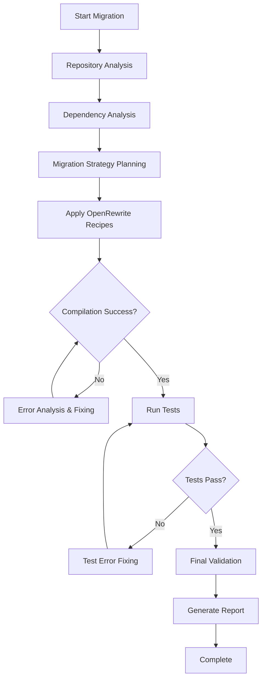

# Intelligent Java Migration System

## Overview

This is an agent-based Java migration system that uses LangChain/LangGraph to orchestrate the complete migration of Java 8/11/17 projects to Java 21, Spring 6, Spring Boot 3.x, and Jakarta EE. The system emulates human developer decision-making processes using intelligent agents.

## Architecture

```
┌─────────────────────────────────────────────────────────────┐
│                    Migration Orchestrator                   │
│                    (LangGraph StateGraph)                  │
└─────────────┬───────────────────────────────────────────────┘
              │
    ┌─────────┴─────────┐
    │   Agent Router    │
    │  (Decision Hub)   │
    └─────────┬─────────┘
              │
    ┌─────────┼─────────┐
    │         │         │
┌───▼───┐ ┌───▼───┐ ┌───▼───┐
│Analysis│ │Execute│ │ Error │
│ Agent  │ │ Agent │ │ Agent │
└───────┘ └───────┘ └───────┘
```

## System Components

### 1. **Migration Orchestrator** (`orchestrator.py`)
- Central LangGraph state machine
- Manages migration workflow state
- Routes decisions between agents
- Tracks progress and handles failures

### 2. **Analysis Agent** (`agents/analysis_agent.py`)
- Repository analysis and dependency discovery
- Maven Central API integration for version checking
- Migration strategy recommendation
- Risk assessment and complexity evaluation

### 3. **Execution Agent** (`agents/execution_agent.py`)
- OpenRewrite recipe execution
- Command execution and monitoring
- Build system management
- Automated migration application

### 4. **Error Fixing Agent** (`agents/error_agent.py`)
- Compilation error analysis and resolution
- Test failure diagnosis and fixing
- Dependency conflict resolution
- Code pattern modernization

### 5. **Tools System** (`tools/`)
- File operations (read, write, modify)
- Command execution with monitoring
- Maven Central API client
- OpenRewrite integration
- Git operations for backup/rollback

## Migration Workflow



## Key Features

### 🤖 **Intelligent Decision Making**
- Agents analyze code patterns and make context-aware decisions
- Dynamic strategy adjustment based on repository characteristics
- Human-like problem-solving approach to migration challenges

### 🔧 **OpenRewrite Integration**
- Automated application of migration recipes
- Custom recipe creation for complex scenarios
- Recipe composition and sequencing

### 📊 **Maven Central Integration**
- Real-time dependency version checking
- Compatibility analysis for Java 21
- Transitive dependency resolution

### 🛠️ **Comprehensive Tooling**
- File system operations with backup/restore
- Command execution with timeout and monitoring
- Error parsing and categorization
- Build system integration (Maven/Gradle)

### 🔄 **Error Recovery System**
- Automatic error detection and classification
- Iterative fixing with learning from previous attempts
- Rollback capabilities for failed migrations
- Human escalation for complex issues

## Usage

### Basic Migration
```python
from orchestrator import MigrationOrchestrator

orchestrator = MigrationOrchestrator()
result = orchestrator.migrate_repository("/path/to/java/project")
```

### Custom Configuration
```python
config = MigrationConfig(
    target_java_version="21",
    target_spring_version="6.0",
    target_spring_boot_version="3.2",
    enable_jakarta_migration=True,
    dry_run=False
)

result = orchestrator.migrate_repository("/path/to/project", config)
```

## Migration Targets

### Java Version Migration
- Java 8 → Java 21 (Direct migration with compatibility checks)
- Java 11 → Java 21 (Moderate complexity migration)
- Java 17 → Java 21 (Low complexity migration)

### Framework Migration
- Spring Framework → Spring 6.x
- Spring Boot 2.x → Spring Boot 3.x
- Java EE → Jakarta EE (javax → jakarta namespace)

### Testing Framework Migration
- JUnit 4 → JUnit 5 (Jupiter)
- TestNG compatibility updates
- Mockito version updates

### Build System Updates
- Maven plugins to Java 21 compatible versions
- Gradle wrapper and plugin updates
- Dependency version resolution

## Configuration

### Environment Variables
```bash
MAVEN_CENTRAL_API_URL=https://search.maven.org/solrsearch/select
OPENREWRITE_CLI_PATH=/path/to/rewrite-cli
LLM_MODEL=claude-3-sonnet-20240229
MAX_RETRY_ATTEMPTS=3
BACKUP_ENABLED=true
```

### Migration Configuration (`migration_config.yaml`)
```yaml
migration:
  target_versions:
    java: "21"
    spring: "6.0"
    spring_boot: "3.2"
  
  strategies:
    dependency_update: "latest_compatible"
    test_migration: "automated_with_validation"
    code_modernization: "conservative"
  
  openrewrite:
    recipes:
      - "org.openrewrite.java.migrate.Java8toJava11"
      - "org.openrewrite.java.migrate.Java11toJava17"
      - "org.openrewrite.java.migrate.Java17toJava21"
      - "org.openrewrite.java.spring.boot3.UpgradeSpringBoot_3_2"
      - "org.openrewrite.java.migrate.jakarta.JavaxMigrationToJakarta"
```

## Error Handling Strategy

### Compilation Errors
1. Parse error messages for patterns
2. Apply common fixes (deprecated API usage, import changes)
3. Use LLM agent for complex error resolution
4. Validate fixes and iterate if needed

### Test Failures
1. Categorize test failures (API changes, dependency issues, configuration)
2. Apply targeted fixes based on failure type
3. Re-run specific test suites to validate fixes
4. Update test configurations as needed

### Dependency Conflicts
1. Analyze dependency tree for conflicts
2. Use Maven Central API to find compatible versions
3. Apply exclusions and version overrides
4. Validate final dependency resolution

## Output and Reporting

### Progress Tracking
- Real-time progress updates during migration
- Detailed logging of all agent decisions and actions
- Error tracking and resolution history

### Final Report
- Migration summary with before/after comparison
- List of all changes made to the codebase
- Recommendations for manual review
- Risk assessment for production deployment

## Directory Structure

```
migration/
├── orchestrator.py              # Main orchestration logic
├── agents/
│   ├── __init__.py
│   ├── analysis_agent.py        # Repository analysis
│   ├── execution_agent.py       # Command execution
│   └── error_agent.py           # Error fixing
├── tools/
│   ├── __init__.py
│   ├── file_operations.py       # File system tools
│   ├── command_executor.py      # Command execution
│   ├── maven_api.py            # Maven Central integration
│   └── openrewrite_client.py   # OpenRewrite integration
├── config/
│   ├── migration_config.yaml   # Default configuration
│   └── agent_prompts.yaml      # Agent system prompts
├── utils/
│   ├── __init__.py
│   ├── state_management.py     # Migration state tracking
│   └── error_parser.py         # Error categorization
└── tests/
    ├── test_orchestrator.py
    ├── test_agents.py
    └── test_tools.py
```

## Getting Started

1. **Install Dependencies**
   ```bash
   pip install -r requirements.txt
   ```

2. **Configure Environment**
   ```bash
   cp .env.example .env
   # Edit .env with your configuration
   ```

3. **Run Migration**
   ```python
   from orchestrator import MigrationOrchestrator
   
   orchestrator = MigrationOrchestrator()
   result = orchestrator.migrate_repository("./xsync")
   ```

## Advanced Features

### Custom Recipe Development
- Create custom OpenRewrite recipes for specific migration patterns
- Recipe testing and validation framework
- Recipe composition for complex migration scenarios

### Integration Capabilities
- CI/CD pipeline integration
- Git workflow integration with branch management
- Slack/Teams notifications for migration progress

### Monitoring and Observability
- Prometheus metrics for migration tracking
- Grafana dashboards for visualization
- OpenTelemetry integration for distributed tracing

---

**Note**: This system is designed to handle the majority of Java migration scenarios automatically while providing intelligent escalation for complex cases that require human intervention.